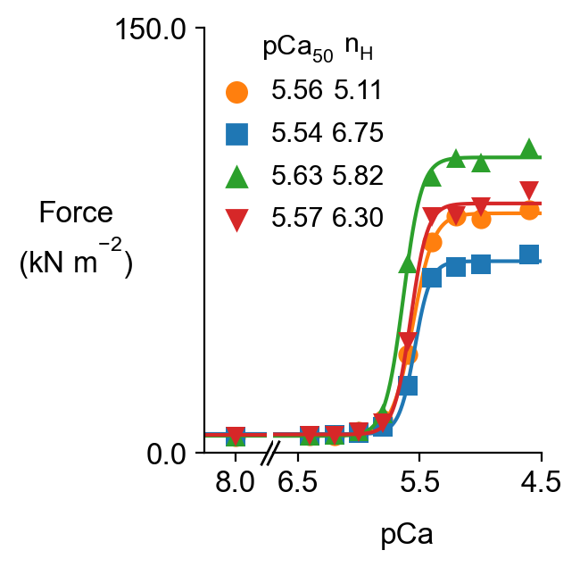
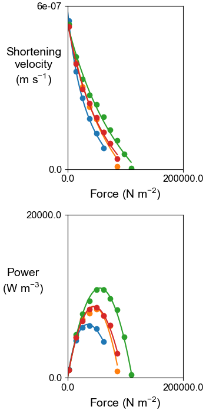

# Readme.md

## Simulations 

### A

`simulations\a\python_code\generate_protocols.py` generates protocol files for:
+ isometric force-pCa curves
+ isotonic releases
and
+ creates an array of jobs that can be copied into the main batch file

The sim_input folders are arranged conceptually as follows

+ 1
  + model_1.json
  + isometric
    + pCas
  + isotonic
    + loads
+ 2
  + model_2.json
  + isometric
    + pCas
  + isotonic
    + loads
+ 3
  + model_3.json
  + isometric
    + pCas
  + isotonic
    + loads
+ 4
  + model_4.json
  + isometric
    + pCas
  + isotonic
    + loads

with the models as follows:
+ model_1 - control
+ model_2 - stabilized SRX
+ model_3 - higher duty ratio
+ model_4 - both stabilized SRX and higher duty ratio

The full folder structure is

````
sim_input
 ┣ 1
 ┃ ┣ isometric
 ┃ ┃ ┣ pCa_46
 ┃ ┃ ┃ ┣ output_handler.json
 ┃ ┃ ┃ ┗ prot.txt
 ┃ ┃ ┣ pCa_50
 ┃ ┃ ┃ ┣ output_handler.json
 ┃ ┃ ┃ ┗ prot.txt
 ┃ ┃ ┣ pCa_52
 ┃ ┃ ┃ ┣ output_handler.json
 ┃ ┃ ┃ ┗ prot.txt
 ┃ ┃ ┣ pCa_54
 ┃ ┃ ┃ ┣ output_handler.json
 ┃ ┃ ┃ ┗ prot.txt
 ┃ ┃ ┣ pCa_56
 ┃ ┃ ┃ ┣ output_handler.json
 ┃ ┃ ┃ ┗ prot.txt
 ┃ ┃ ┣ pCa_58
 ┃ ┃ ┃ ┣ output_handler.json
 ┃ ┃ ┃ ┗ prot.txt
 ┃ ┃ ┣ pCa_60
 ┃ ┃ ┃ ┣ output_handler.json
 ┃ ┃ ┃ ┗ prot.txt
 ┃ ┃ ┣ pCa_62
 ┃ ┃ ┃ ┣ output_handler.json
 ┃ ┃ ┃ ┗ prot.txt
 ┃ ┃ ┣ pCa_64
 ┃ ┃ ┃ ┣ output_handler.json
 ┃ ┃ ┃ ┗ prot.txt
 ┃ ┃ ┗ pCa_80
 ┃ ┃ ┃ ┣ output_handler.json
 ┃ ┃ ┃ ┗ prot.txt
 ┃ ┣ isotonic
 ┃ ┃ ┣ 0
 ┃ ┃ ┃ ┣ output_handler.json
 ┃ ┃ ┃ ┗ prot.txt
 ┃ ┃ ┣ 1
 ┃ ┃ ┃ ┣ output_handler.json
 ┃ ┃ ┃ ┗ prot.txt
 ┃ ┃ ┣ 2
 ┃ ┃ ┃ ┣ output_handler.json
 ┃ ┃ ┃ ┗ prot.txt
 ┃ ┃ ┣ 3
 ┃ ┃ ┃ ┣ output_handler.json
 ┃ ┃ ┃ ┗ prot.txt
 ┃ ┃ ┣ 4
 ┃ ┃ ┃ ┣ output_handler.json
 ┃ ┃ ┃ ┗ prot.txt
 ┃ ┃ ┣ 5
 ┃ ┃ ┃ ┣ output_handler.json
 ┃ ┃ ┃ ┗ prot.txt
 ┃ ┃ ┣ 6
 ┃ ┃ ┃ ┣ output_handler.json
 ┃ ┃ ┃ ┗ prot.txt
 ┃ ┃ ┣ 7
 ┃ ┃ ┃ ┣ output_handler.json
 ┃ ┃ ┃ ┗ prot.txt
 ┃ ┃ ┣ 8
 ┃ ┃ ┃ ┣ output_handler.json
 ┃ ┃ ┃ ┗ prot.txt
 ┃ ┃ ┗ 9
 ┃ ┃ ┃ ┣ output_handler.json
 ┃ ┃ ┃ ┗ prot.txt
 ┃ ┗ model_1.json
 ┣ 2
 ┃ ┣ isometric
 ┃ ┃ ┣ pCa_46
 ┃ ┃ ┃ ┣ output_handler.json
 ┃ ┃ ┃ ┗ prot.txt
 ┃ ┃ ┣ pCa_50
 ┃ ┃ ┃ ┣ output_handler.json
 ┃ ┃ ┃ ┗ prot.txt
 ┃ ┃ ┣ pCa_52
 ┃ ┃ ┃ ┣ output_handler.json
 ┃ ┃ ┃ ┗ prot.txt
 ┃ ┃ ┣ pCa_54
 ┃ ┃ ┃ ┣ output_handler.json
 ┃ ┃ ┃ ┗ prot.txt
 ┃ ┃ ┣ pCa_56
 ┃ ┃ ┃ ┣ output_handler.json
 ┃ ┃ ┃ ┗ prot.txt
 ┃ ┃ ┣ pCa_58
 ┃ ┃ ┃ ┣ output_handler.json
 ┃ ┃ ┃ ┗ prot.txt
 ┃ ┃ ┣ pCa_60
 ┃ ┃ ┃ ┣ output_handler.json
 ┃ ┃ ┃ ┗ prot.txt
 ┃ ┃ ┣ pCa_62
 ┃ ┃ ┃ ┣ output_handler.json
 ┃ ┃ ┃ ┗ prot.txt
 ┃ ┃ ┣ pCa_64
 ┃ ┃ ┃ ┣ output_handler.json
 ┃ ┃ ┃ ┗ prot.txt
 ┃ ┃ ┗ pCa_80
 ┃ ┃ ┃ ┣ output_handler.json
 ┃ ┃ ┃ ┗ prot.txt
 ┃ ┣ isotonic
 ┃ ┃ ┣ 0
 ┃ ┃ ┃ ┣ output_handler.json
 ┃ ┃ ┃ ┗ prot.txt
 ┃ ┃ ┣ 1
 ┃ ┃ ┃ ┣ output_handler.json
 ┃ ┃ ┃ ┗ prot.txt
 ┃ ┃ ┣ 2
 ┃ ┃ ┃ ┣ output_handler.json
 ┃ ┃ ┃ ┗ prot.txt
 ┃ ┃ ┣ 3
 ┃ ┃ ┃ ┣ output_handler.json
 ┃ ┃ ┃ ┗ prot.txt
 ┃ ┃ ┣ 4
 ┃ ┃ ┃ ┣ output_handler.json
 ┃ ┃ ┃ ┗ prot.txt
 ┃ ┃ ┣ 5
 ┃ ┃ ┃ ┣ output_handler.json
 ┃ ┃ ┃ ┗ prot.txt
 ┃ ┃ ┣ 6
 ┃ ┃ ┃ ┣ output_handler.json
 ┃ ┃ ┃ ┗ prot.txt
 ┃ ┃ ┣ 7
 ┃ ┃ ┃ ┣ output_handler.json
 ┃ ┃ ┃ ┗ prot.txt
 ┃ ┃ ┣ 8
 ┃ ┃ ┃ ┣ output_handler.json
 ┃ ┃ ┃ ┗ prot.txt
 ┃ ┃ ┗ 9
 ┃ ┃ ┃ ┣ output_handler.json
 ┃ ┃ ┃ ┗ prot.txt
 ┃ ┗ model_2.json
 ┣ 3
 ┃ ┣ isometric
 ┃ ┃ ┣ pCa_46
 ┃ ┃ ┃ ┣ output_handler.json
 ┃ ┃ ┃ ┗ prot.txt
 ┃ ┃ ┣ pCa_50
 ┃ ┃ ┃ ┣ output_handler.json
 ┃ ┃ ┃ ┗ prot.txt
 ┃ ┃ ┣ pCa_52
 ┃ ┃ ┃ ┣ output_handler.json
 ┃ ┃ ┃ ┗ prot.txt
 ┃ ┃ ┣ pCa_54
 ┃ ┃ ┃ ┣ output_handler.json
 ┃ ┃ ┃ ┗ prot.txt
 ┃ ┃ ┣ pCa_56
 ┃ ┃ ┃ ┣ output_handler.json
 ┃ ┃ ┃ ┗ prot.txt
 ┃ ┃ ┣ pCa_58
 ┃ ┃ ┃ ┣ output_handler.json
 ┃ ┃ ┃ ┗ prot.txt
 ┃ ┃ ┣ pCa_60
 ┃ ┃ ┃ ┣ output_handler.json
 ┃ ┃ ┃ ┗ prot.txt
 ┃ ┃ ┣ pCa_62
 ┃ ┃ ┃ ┣ output_handler.json
 ┃ ┃ ┃ ┗ prot.txt
 ┃ ┃ ┣ pCa_64
 ┃ ┃ ┃ ┣ output_handler.json
 ┃ ┃ ┃ ┗ prot.txt
 ┃ ┃ ┗ pCa_80
 ┃ ┃ ┃ ┣ output_handler.json
 ┃ ┃ ┃ ┗ prot.txt
 ┃ ┣ isotonic
 ┃ ┃ ┣ 0
 ┃ ┃ ┃ ┣ output_handler.json
 ┃ ┃ ┃ ┗ prot.txt
 ┃ ┃ ┣ 1
 ┃ ┃ ┃ ┣ output_handler.json
 ┃ ┃ ┃ ┗ prot.txt
 ┃ ┃ ┣ 2
 ┃ ┃ ┃ ┣ output_handler.json
 ┃ ┃ ┃ ┗ prot.txt
 ┃ ┃ ┣ 3
 ┃ ┃ ┃ ┣ output_handler.json
 ┃ ┃ ┃ ┗ prot.txt
 ┃ ┃ ┣ 4
 ┃ ┃ ┃ ┣ output_handler.json
 ┃ ┃ ┃ ┗ prot.txt
 ┃ ┃ ┣ 5
 ┃ ┃ ┃ ┣ output_handler.json
 ┃ ┃ ┃ ┗ prot.txt
 ┃ ┃ ┣ 6
 ┃ ┃ ┃ ┣ output_handler.json
 ┃ ┃ ┃ ┗ prot.txt
 ┃ ┃ ┣ 7
 ┃ ┃ ┃ ┣ output_handler.json
 ┃ ┃ ┃ ┗ prot.txt
 ┃ ┃ ┣ 8
 ┃ ┃ ┃ ┣ output_handler.json
 ┃ ┃ ┃ ┗ prot.txt
 ┃ ┃ ┗ 9
 ┃ ┃ ┃ ┣ output_handler.json
 ┃ ┃ ┃ ┗ prot.txt
 ┃ ┗ model_3.json
 ┣ 4
 ┃ ┣ isometric
 ┃ ┃ ┣ pCa_46
 ┃ ┃ ┃ ┣ output_handler.json
 ┃ ┃ ┃ ┗ prot.txt
 ┃ ┃ ┣ pCa_50
 ┃ ┃ ┃ ┣ output_handler.json
 ┃ ┃ ┃ ┗ prot.txt
 ┃ ┃ ┣ pCa_52
 ┃ ┃ ┃ ┣ output_handler.json
 ┃ ┃ ┃ ┗ prot.txt
 ┃ ┃ ┣ pCa_54
 ┃ ┃ ┃ ┣ output_handler.json
 ┃ ┃ ┃ ┗ prot.txt
 ┃ ┃ ┣ pCa_56
 ┃ ┃ ┃ ┣ output_handler.json
 ┃ ┃ ┃ ┗ prot.txt
 ┃ ┃ ┣ pCa_58
 ┃ ┃ ┃ ┣ output_handler.json
 ┃ ┃ ┃ ┗ prot.txt
 ┃ ┃ ┣ pCa_60
 ┃ ┃ ┃ ┣ output_handler.json
 ┃ ┃ ┃ ┗ prot.txt
 ┃ ┃ ┣ pCa_62
 ┃ ┃ ┃ ┣ output_handler.json
 ┃ ┃ ┃ ┗ prot.txt
 ┃ ┃ ┣ pCa_64
 ┃ ┃ ┃ ┣ output_handler.json
 ┃ ┃ ┃ ┗ prot.txt
 ┃ ┃ ┗ pCa_80
 ┃ ┃ ┃ ┣ output_handler.json
 ┃ ┃ ┃ ┗ prot.txt
 ┃ ┣ isotonic
 ┃ ┃ ┣ 0
 ┃ ┃ ┃ ┣ output_handler.json
 ┃ ┃ ┃ ┗ prot.txt
 ┃ ┃ ┣ 1
 ┃ ┃ ┃ ┣ output_handler.json
 ┃ ┃ ┃ ┗ prot.txt
 ┃ ┃ ┣ 2
 ┃ ┃ ┃ ┣ output_handler.json
 ┃ ┃ ┃ ┗ prot.txt
 ┃ ┃ ┣ 3
 ┃ ┃ ┃ ┣ output_handler.json
 ┃ ┃ ┃ ┗ prot.txt
 ┃ ┃ ┣ 4
 ┃ ┃ ┃ ┣ output_handler.json
 ┃ ┃ ┃ ┗ prot.txt
 ┃ ┃ ┣ 5
 ┃ ┃ ┃ ┣ output_handler.json
 ┃ ┃ ┃ ┗ prot.txt
 ┃ ┃ ┣ 6
 ┃ ┃ ┃ ┣ output_handler.json
 ┃ ┃ ┃ ┗ prot.txt
 ┃ ┃ ┣ 7
 ┃ ┃ ┃ ┣ output_handler.json
 ┃ ┃ ┃ ┗ prot.txt
 ┃ ┃ ┣ 8
 ┃ ┃ ┃ ┣ output_handler.json
 ┃ ┃ ┃ ┗ prot.txt
 ┃ ┃ ┗ 9
 ┃ ┃ ┃ ┣ output_handler.json
 ┃ ┃ ┃ ┗ prot.txt
 ┃ ┗ model_4.json
 ┗ sim_options.json
````

To generate the figures:
+ run the `<repo>/simulations/a/batch.json`

In the `isometric` and `isotonic` folders of `<repo>/simualtions/a` you will get



